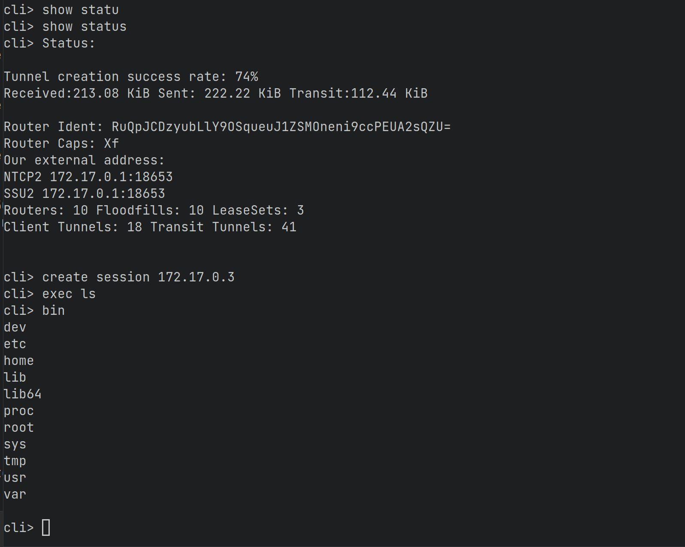

## i2prc
* about<br>
基于i2p匿名网络的远程控制台<br>
关于i2p技术，下面是 [i2p page](https://geti2p.net/en/) 的介绍
  > The I2P network is a fully encrypted peer-to-peer overlay network. An observer cannot see a message's contents, source, or destination. No one can see where traffic is coming from, where it is going, or what the contents are. Additionally I2P transports offer resistance to recognition and blocking by censors. Because the network relies on peers to route traffic, location-based blocking is a challenge that grows with the network. Every router in the network participates in making the network anonymous. Except in cases where it would be unsafe, everyone participates in sending and receiving network traffic.
* dependence<br>
本项目直接引用了i2pd源码，如果包管理器提供了i2pd dev包，也可直接使用
  > boost<br>
  > openssl v1.0<br>
  > [i2pd](https://github.com/PurpleI2P/i2pd) <br>
  > zlib<br>
  > docker/podman...(meshnet test)
* build<br>
  ```
  cd i2prc/src
  mkdir build
  cd build
  cmake -S .. -B .
  make
  ```
  构建后将可执行文件拷贝至 **i2prc/docker/data/** 可以使用docker组网测试
* feature<br>
  * 控制台
  * 发送消息
  * 文件上传下载
  * 命令执行
  * i2p状态查看
* running<br>
