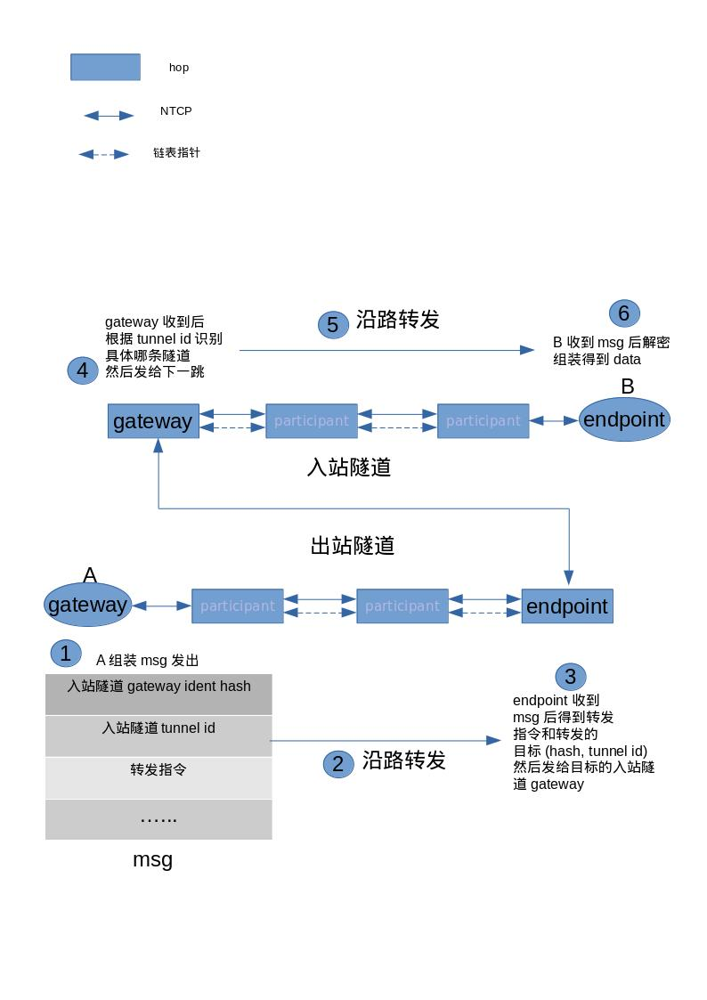
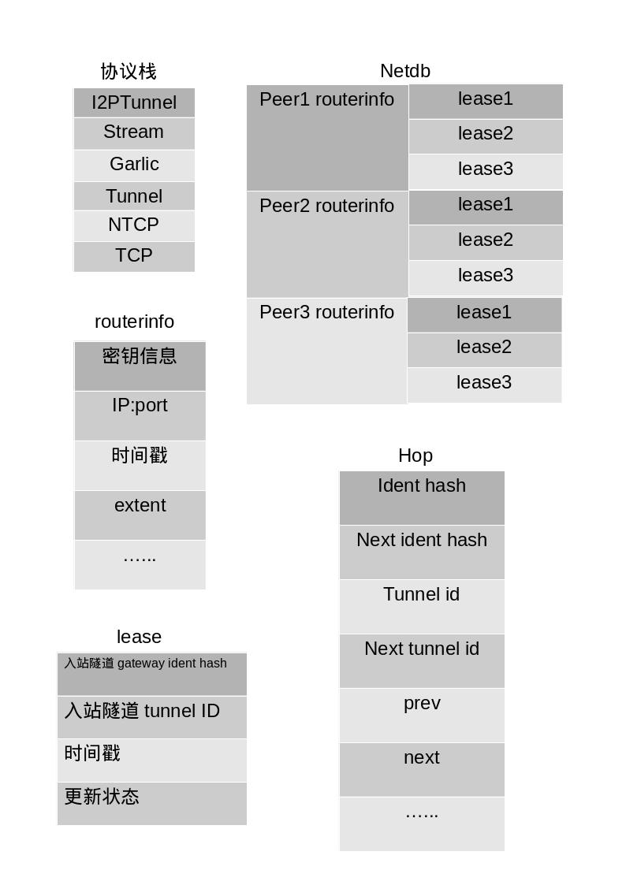

### structure



### Tunnel
* TunnelHopConfig
  ```c++
  std::shared_ptr<const i2p::data::IdentityEx> ident;
  i2p::data::IdentHash nextIdent;
  uint32_t tunnelID, nextTunnelID;
  uint8_t layerKey[32];
  uint8_t ivKey[32];
  uint8_t replyKey[32];
  uint8_t replyIV[16];
  bool isGateway, isEndpoint;
  TunnelHopConfig * next, * prev;
  int recordIndex;
  ```
  理解为一个ListNode，也对应一个i2pd节点,recordIndex是在BuildMsg包含的几个record具体第几个<br>
  入站隧道的FirstHop为Gateway，endpoint为自身；出站隧道的自身为Gateway，endpoint为LastHop
* TunnelConfig
  ```c++
  TunnelHopConfig * m_FirstHop, * m_LastHop;
  bool m_IsShort;
  i2p::data::RouterInfo::CompatibleTransports m_FarEndTransports;
  ```
  理解为一个双向链表
* TunnelBase
  ```c++
  uint32_t m_TunnelID, m_NextTunnelID;
  i2p::data::IdentHash m_NextIdent;
  uint32_t m_CreationTime;
  ```
  TunnelBase是基类，TunnelID是隧道的标识，当一个节点作为多个隧道的节点时，TunnelID用来确定是哪一条隧道<br>
  如果是入站隧道，TunnelID是LastHop的NextTunnelID；如果是出站隧道，TunnelID是FirstHop的TunnelID
* TransitTunnel
  自己作为中转节点时的处理
  ```c++
  class TransitTunnelParticipant: public TransitTunnel
  ```
  作为普通隧道中转节点
  ```c++
  class TransitTunnelGateway: public TransitTunnel
  ```
  作为入站隧道的FirstHop也就是Gateway
  ```c++
  class TransitTunnelEndpoint: public TransitTunnel
  ```
  作为出站隧道的LastHop也就是endpoint
* Tunnel
  ```c++
  std::shared_ptr<const TunnelConfig> m_Config;
  std::vector<TunnelHop> m_Hops;
  bool m_IsShortBuildMessage;
  std::shared_ptr<TunnelPool> m_Pool;
  TunnelState m_State;
  i2p::data::RouterInfo::CompatibleTransports m_FarEndTransports;
  bool m_IsRecreated;
  uint64_t m_Latency;
  ```
  Tunnel继承自TunnelBase，主要包含一个"隧道链表"<br>

* InboundTunnel
  ```c++
  TunnelEndpoint m_Endpoint;
  ```
  入站隧道继承自Tunnel,自身节点作为入站隧道的endpoint节点
* OutboundTunnel
  ```c++
  std::mutex m_SendMutex;
  TunnelGateway m_Gateway;
  i2p::data::IdentHash m_EndpointIdentHash;
  ```
  出站隧道继承自Tunnel,自身节点作为出站隧道的Gateway
  * TunnelGateway
    ```c++
    TunnelGateway (TunnelBase * tunnel):
    m_Tunnel (tunnel), m_NumSentBytes (0) {};
    void SendTunnelDataMsg (const TunnelMessageBlock& block);
    void PutTunnelDataMsg (const TunnelMessageBlock& block);
    void SendBuffer ();
    size_t GetNumSentBytes () const { return m_NumSentBytes; };


    TunnelBase * m_Tunnel;
    TunnelGatewayBuffer m_Buffer;
    size_t m_NumSentBytes;
    ```
    Buffer理解为消息队列，向该队列put message，然后方法 ***SendBuffer()*** 就是出站隧道发送消息的接口，函数使用transport的NTCP连接发送给下一个节点即Gateway-->FirstHop<br>

  TunnelBase是个虚基类，有几个方法需要重写
  ```c++
  virtual void HandleTunnelDataMsg (std::shared_ptr<i2p::I2NPMessage>&& tunnelMsg) = 0;
  virtual void SendTunnelDataMsg (std::shared_ptr<i2p::I2NPMessage> msg) = 0;
  virtual void EncryptTunnelMsg (std::shared_ptr<const I2NPMessage> in, std::shared_ptr<I2NPMessage> out) = 0;
  ```
  出站入站和中转隧道都分别重写了这些方法，自身作为不同节点的处理各自实现<br>
  如果是Endpoint，解析Msg里包含的Gateway信息，也就是入站隧道的Gateway节点，然后将信息发给这个节点
  ```c++
  void TunnelEndpoint::HandleNextMessage (const TunnelMessageBlock& msg)
  {
      if (!m_IsInbound && msg.data->IsExpired ())
      {
          LogPrint (eLogInfo, "TunnelMessage: Message expired");
          return;
      }
      uint8_t typeID = msg.data->GetTypeID ();
      LogPrint (eLogDebug, "TunnelMessage: Handle fragment of ", msg.data->GetLength (), " bytes, msg type ", (int)typeID);

      switch (msg.deliveryType)
      {
          case eDeliveryTypeLocal:
              i2p::HandleI2NPMessage (msg.data);
          break;
          case eDeliveryTypeTunnel:
              if (!m_IsInbound) // outbound transit tunnel
                  i2p::transport::transports.SendMessage (msg.hash, i2p::CreateTunnelGatewayMsg (msg.tunnelID, msg.data));
              else
                  LogPrint (eLogError, "TunnelMessage: Delivery type 'tunnel' arrived from an inbound tunnel, dropped");
          break;
          case eDeliveryTypeRouter:
              if (!m_IsInbound) // outbound transit tunnel
                  i2p::transport::transports.SendMessage (msg.hash, msg.data);
              else // we shouldn't send this message. possible leakage
                  LogPrint (eLogError, "TunnelMessage: Delivery type 'router' arrived from an inbound tunnel, dropped");
          break;
          default:
              LogPrint (eLogError, "TunnelMessage: Unknown delivery type ", (int)msg.deliveryType);
      };
  }
  ```
  如果是Gateway节点，就把消息 **PutI2NPMsg** 进TunnelGateway的Buffer里，该函数非常关键，里面包含了消息达到Endpoint后转发给目标入站隧道Gateway的指令
  ```c++
  void TunnelGatewayBuffer::PutI2NPMsg (const TunnelMessageBlock& block)
  {
        bool messageCreated = false;
        if (!m_CurrentTunnelDataMsg)
        {
            CreateCurrentTunnelDataMessage ();
            messageCreated = true;
        }

        // create delivery instructions
        uint8_t di[43]; // max delivery instruction length is 43 for tunnel
        size_t diLen = 1;// flag
        if (block.deliveryType != eDeliveryTypeLocal) // tunnel or router
        {
            if (block.deliveryType == eDeliveryTypeTunnel)
            {
                htobe32buf (di + diLen, block.tunnelID);
                diLen += 4; // tunnelID
            }

            memcpy (di + diLen, block.hash, 32);
            diLen += 32; //len
        }
        di[0] = block.deliveryType << 5; // set delivery type

        // create fragments
        const std::shared_ptr<I2NPMessage> & msg = block.data;
        size_t fullMsgLen = diLen + msg->GetLength () + 2; // delivery instructions + payload + 2 bytes length

        if (!messageCreated && fullMsgLen > m_RemainingSize) // check if we should complete previous message
        {
            size_t numFollowOnFragments = fullMsgLen / TUNNEL_DATA_MAX_PAYLOAD_SIZE;
            // length of bytes doesn't fit full tunnel message
            // every follow-on fragment adds 7 bytes
            size_t nonFit = (fullMsgLen + numFollowOnFragments*7) % TUNNEL_DATA_MAX_PAYLOAD_SIZE;
            if (!nonFit || nonFit > m_RemainingSize || m_RemainingSize < fullMsgLen/5)
            {
                CompleteCurrentTunnelDataMessage ();
                CreateCurrentTunnelDataMessage ();
            }
        }
        if (fullMsgLen <= m_RemainingSize)
        {
            // message fits. First and last fragment
            htobe16buf (di + diLen, msg->GetLength ());
            diLen += 2; // size
            memcpy (m_CurrentTunnelDataMsg->buf + m_CurrentTunnelDataMsg->len, di, diLen);
            memcpy (m_CurrentTunnelDataMsg->buf + m_CurrentTunnelDataMsg->len + diLen, msg->GetBuffer (), msg->GetLength ());
            m_CurrentTunnelDataMsg->len += diLen + msg->GetLength ();
            m_RemainingSize -= diLen + msg->GetLength ();
            if (!m_RemainingSize)
                CompleteCurrentTunnelDataMessage ();
        }
        else
        {
            if (diLen + 6 <= m_RemainingSize)
            {
                // delivery instructions fit
                uint32_t msgID;
                memcpy (&msgID, msg->GetHeader () + I2NP_HEADER_MSGID_OFFSET, 4); // in network bytes order
                size_t size = m_RemainingSize - diLen - 6; // 6 = 4 (msgID) + 2 (size)

                // first fragment
                di[0] |= 0x08; // fragmented
                htobuf32 (di + diLen, msgID);
                diLen += 4; // Message ID
                htobe16buf (di + diLen, size);
                diLen += 2; // size
                memcpy (m_CurrentTunnelDataMsg->buf + m_CurrentTunnelDataMsg->len, di, diLen);
                memcpy (m_CurrentTunnelDataMsg->buf + m_CurrentTunnelDataMsg->len + diLen, msg->GetBuffer (), size);
                m_CurrentTunnelDataMsg->len += diLen + size;
                CompleteCurrentTunnelDataMessage ();
                // follow on fragments
                int fragmentNumber = 1;
                while (size < msg->GetLength ())
                {
                    CreateCurrentTunnelDataMessage ();
                    uint8_t * buf = m_CurrentTunnelDataMsg->GetBuffer ();
                    buf[0] = 0x80 | (fragmentNumber << 1); // frag
                    bool isLastFragment = false;
                    size_t s = msg->GetLength () - size;
                    if (s > TUNNEL_DATA_MAX_PAYLOAD_SIZE - 7) // 7 follow on instructions
                        s = TUNNEL_DATA_MAX_PAYLOAD_SIZE - 7;
                    else // last fragment
                    {
                        buf[0] |= 0x01;
                        isLastFragment = true;
                    }
                    htobuf32 (buf + 1, msgID); //Message ID
                    htobe16buf (buf + 5, s); // size
                    memcpy (buf + 7, msg->GetBuffer () + size, s);
                    m_CurrentTunnelDataMsg->len += s+7;
                    if (isLastFragment)
                    {
                        if(m_RemainingSize < (s+7)) {
                            LogPrint (eLogError, "TunnelGateway: remaining size overflow: ", m_RemainingSize, " < ", s+7);
                        } else {
                            m_RemainingSize -= s+7;
                            if (m_RemainingSize == 0)
                                CompleteCurrentTunnelDataMessage ();
                        }
                    }
                    else
                        CompleteCurrentTunnelDataMessage ();
                    size += s;
                    fragmentNumber++;
                }
            }
            else
            {
                // delivery instructions don't fit. Create new message
                CompleteCurrentTunnelDataMessage ();
                PutI2NPMsg (block);
                // don't delete msg because it's taken care inside
            }
        }
  }
  ```
  ```c++
  void TransitTunnelGateway::SendTunnelDataMsg (std::shared_ptr<i2p::I2NPMessage> msg)
  {
        TunnelMessageBlock block;
        block.deliveryType = eDeliveryTypeLocal;
        block.data = msg;
        std::unique_lock<std::mutex> l(m_SendMutex);
        m_Gateway.PutTunnelDataMsg (block);
  }
  ```
  如果是普通中转节点，就直接通过Transport发送即可
  ```c++
  void TransitTunnelParticipant::FlushTunnelDataMsgs ()
  {
        if (!m_TunnelDataMsgs.empty ())
        {
            auto num = m_TunnelDataMsgs.size ();
            if (num > 1)
                LogPrint (eLogDebug, "TransitTunnel: ", GetTunnelID (), "->", GetNextTunnelID (), " ", num);
            i2p::transport::transports.SendMessages (GetNextIdentHash (), m_TunnelDataMsgs);
            m_TunnelDataMsgs.clear ();
        }
  }
  ```

  隧道启动后会先处理各种I2NP消息,主要分为数据消息，和用于隧道自身建立的消息
  ```c++
  while (m_IsRunning)
  {
    try
    {
        auto msg = m_Queue.GetNextWithTimeout (1000); // 1 sec
        if (msg)
        {
            int numMsgs = 0;
            uint32_t prevTunnelID = 0, tunnelID = 0;
            std::shared_ptr<TunnelBase> prevTunnel;
            do
            {
                std::shared_ptr<TunnelBase> tunnel;
                uint8_t typeID = msg->GetTypeID ();
                switch (typeID)
                {
                    case eI2NPTunnelData:
                        case eI2NPTunnelGateway:
                        {
                            tunnelID = bufbe32toh (msg->GetPayload ());
                            if (tunnelID == prevTunnelID)
                                tunnel = prevTunnel;
                            else if (prevTunnel)
                                prevTunnel->FlushTunnelDataMsgs ();
                            if (!tunnel)
                                tunnel = GetTunnel (tunnelID);
                            if (tunnel)
                            {
                                if (typeID == eI2NPTunnelData)
                                    tunnel->HandleTunnelDataMsg (std::move (msg));
                                else // tunnel gateway assumed
                                HandleTunnelGatewayMsg (tunnel, msg);
                            }
                            else
                                LogPrint (eLogWarning, "Tunnel: Tunnel not found, tunnelID=", tunnelID, " previousTunnelID=", prevTunnelID, " type=", (int)typeID);
                            break;
                        }
                        case eI2NPVariableTunnelBuild:case eI2NPVariableTunnelBuildReply:case eI2NPShortTunnelBuild:case eI2NPShortTunnelBuildReply:case eI2NPTunnelBuild:case eI2NPTunnelBuildReply:
                            HandleTunnelBuildI2NPMessage (msg);break;default:LogPrint (eLogWarning, "Tunnel: Unexpected message type ", (int) typeID);
                }
                msg = (numMsgs <= MAX_TUNNEL_MSGS_BATCH_SIZE) ? m_Queue.Get () : nullptr;
                if (msg)
                {
                    prevTunnelID = tunnelID;
                    prevTunnel = tunnel;
                    numMsgs++;
                }
                else if (tunnel)
                    tunnel->FlushTunnelDataMsgs ();
            }
            while (msg);
        }
  ```
  数据消息携带用户数据的或者自身运行需要传输的数据比如路由信息，处理方式就是根部不同的组件去各自处理，消息包含TunnelID,找到隧道类型后，不同隧道去分别处理这些消息
  如果是入站隧道，则通过TunnelEndPoint接受并解析这个消息，组成完成的用户数据;如果是出站隧道则通过隧道发送出去;如果是转交数据，则通过转交隧道传递

  ```c++
  if (i2p::transport::transports.IsOnline())
  {
      uint64_t ts = i2p::util::GetSecondsSinceEpoch ();
      if (ts - lastTs >= TUNNEL_MANAGE_INTERVAL || // manage tunnels every 15 seconds
      ts + TUNNEL_MANAGE_INTERVAL < lastTs)
      {
          ManageTunnels (ts);
          lastTs = ts;
      }
      if (ts - lastPoolsTs >= TUNNEL_POOLS_MANAGE_INTERVAL || // manage pools every 5 seconds
      ts + TUNNEL_POOLS_MANAGE_INTERVAL < lastPoolsTs)
      {
          ManageTunnelPools (ts);
          lastPoolsTs = ts;
      }
      if (ts - lastMemoryPoolTs >= TUNNEL_MEMORY_POOL_MANAGE_INTERVAL ||
      ts + TUNNEL_MEMORY_POOL_MANAGE_INTERVAL < lastMemoryPoolTs) // manage memory pool every 2 minutes
      {
          m_I2NPTunnelEndpointMessagesMemoryPool.CleanUpMt ();
          m_I2NPTunnelMessagesMemoryPool.CleanUpMt ();
          lastMemoryPoolTs = ts;
      }
  }
  ```
  其次Tunnels管理隧道,如果隧道数量不够则创建隧道，隧道过期则删除隧道
  ```c++
  void Tunnel::Build (uint32_t replyMsgID, std::shared_ptr<OutboundTunnel> outboundTunnel)
  {
        auto numHops = m_Config->GetNumHops ();
        const int numRecords = numHops <= STANDARD_NUM_RECORDS ? STANDARD_NUM_RECORDS : MAX_NUM_RECORDS;
        auto msg = numRecords <= STANDARD_NUM_RECORDS ? NewI2NPShortMessage () : NewI2NPMessage ();
        *msg->GetPayload () = numRecords;
        const size_t recordSize = m_Config->IsShort () ? SHORT_TUNNEL_BUILD_RECORD_SIZE : TUNNEL_BUILD_RECORD_SIZE;
        msg->len += numRecords*recordSize + 1;
        // shuffle records
        std::vector<int> recordIndicies;
        for (int i = 0; i < numRecords; i++) recordIndicies.push_back(i);
        std::shuffle (recordIndicies.begin(), recordIndicies.end(), std::mt19937(std::random_device()()));

        // create real records
        uint8_t * records = msg->GetPayload () + 1;
        TunnelHopConfig * hop = m_Config->GetFirstHop ();
        int i = 0;
        while (hop)
        {
            uint32_t msgID;
            if (hop->next) // we set replyMsgID for last hop only
                RAND_bytes ((uint8_t *)&msgID, 4);
            else
                msgID = replyMsgID;
            hop->recordIndex = recordIndicies[i]; i++;
            hop->CreateBuildRequestRecord (records, msgID);
            hop = hop->next;
        }
        // fill up fake records with random data
        for (int i = numHops; i < numRecords; i++)
        {
            int idx = recordIndicies[i];
            RAND_bytes (records + idx*recordSize, recordSize);
        }

        // decrypt real records
        hop = m_Config->GetLastHop ()->prev;
        while (hop)
        {
            // decrypt records after current hop
            TunnelHopConfig * hop1 = hop->next;
            while (hop1)
            {
                hop->DecryptRecord (records, hop1->recordIndex);
                hop1 = hop1->next;
            }
            hop = hop->prev;
        }
        msg->FillI2NPMessageHeader (m_Config->IsShort () ? eI2NPShortTunnelBuild : eI2NPVariableTunnelBuild);

        // send message
        if (outboundTunnel)
        {
            if (m_Config->IsShort ())
            {
                auto ident = m_Config->GetFirstHop () ? m_Config->GetFirstHop ()->ident : nullptr;
                if (ident && ident->GetIdentHash () != outboundTunnel->GetNextIdentHash ()) // don't encrypt if IBGW = OBEP
                {
                    auto msg1 = i2p::garlic::WrapECIESX25519MessageForRouter (msg, ident->GetEncryptionPublicKey ());
                    if (msg1) msg = msg1;
                }
            }
            outboundTunnel->SendTunnelDataMsgTo (GetNextIdentHash (), 0, msg);
        }
        else
        {
            if (m_Config->IsShort () && m_Config->GetLastHop () &&
                m_Config->GetLastHop ()->ident->GetIdentHash () != m_Config->GetLastHop ()->nextIdent)
            {
                // add garlic key/tag for reply
                uint8_t key[32];
                uint64_t tag = m_Config->GetLastHop ()->GetGarlicKey (key);
                if (m_Pool && m_Pool->GetLocalDestination ())
                    m_Pool->GetLocalDestination ()->SubmitECIESx25519Key (key, tag);
                else
                    i2p::context.AddECIESx25519Key (key, tag);
            }
            i2p::transport::transports.SendMessage (GetNextIdentHash (), msg);
        }
  }
  ```
  创建隧道时，会创建一条BuildMsg的I2NPMsg,消息里包含了隧道的节点的信息，如果是出站隧道，直接通过transport发到FirstHop，
  FirstHop得到消息后，解析自己的节点信息，其中包含了下一节点也就是下一跳的节点信息，FirstHop会根据这个信息去与下一跳建立连接并
  把这个BuildMsg继续发送给下一跳，依次建立其隧道。自身只需将这个BuildMsg发到下一跳即可，入站隧道的区别是，这条BuildMsg是通过出站隧道发出的，
  此时隧道状态为”未决“(pending). 出站隧道的Endpoint包含了一个入站隧道的Gateway信息，
  Endpoint将replyMsg发送给这个Gateway，replyMsg沿着入站隧道进入自身，收到该replyMsg即建立隧道
  对于出站隧道而言，自身作为Endpoint，前面的节点顺着入站节点将建立信息发送到自身，直接处理即建立隧道
  ```c++
  static bool HandleBuildRequestRecords (int num, uint8_t * records, uint8_t * clearText)
  {
        for (int i = 0; i < num; i++)
        {
            uint8_t * record = records + i*TUNNEL_BUILD_RECORD_SIZE;
            if (!memcmp (record + BUILD_REQUEST_RECORD_TO_PEER_OFFSET, (const uint8_t *)i2p::context.GetRouterInfo ().GetIdentHash (), 16))
            {
                LogPrint (eLogDebug, "I2NP: Build request record ", i, " is ours");
                if (!i2p::context.DecryptTunnelBuildRecord (record + BUILD_REQUEST_RECORD_ENCRYPTED_OFFSET, clearText)) return false;
                uint8_t retCode = 0;
                // replace record to reply
                if (i2p::context.AcceptsTunnels () && !i2p::context.IsHighCongestion ())
                {
                    auto transitTunnel = i2p::tunnel::CreateTransitTunnel (
                            bufbe32toh (clearText + ECIES_BUILD_REQUEST_RECORD_RECEIVE_TUNNEL_OFFSET),
                            clearText + ECIES_BUILD_REQUEST_RECORD_NEXT_IDENT_OFFSET,
                            bufbe32toh (clearText + ECIES_BUILD_REQUEST_RECORD_NEXT_TUNNEL_OFFSET),
                            clearText + ECIES_BUILD_REQUEST_RECORD_LAYER_KEY_OFFSET,
                            clearText + ECIES_BUILD_REQUEST_RECORD_IV_KEY_OFFSET,
                            clearText[ECIES_BUILD_REQUEST_RECORD_FLAG_OFFSET] & TUNNEL_BUILD_RECORD_GATEWAY_FLAG,
                            clearText[ECIES_BUILD_REQUEST_RECORD_FLAG_OFFSET] & TUNNEL_BUILD_RECORD_ENDPOINT_FLAG);
                    if (!i2p::tunnel::tunnels.AddTransitTunnel (transitTunnel))
                        retCode = 30;
                }
                else
                    retCode = 30; // always reject with bandwidth reason (30)

                memset (record + ECIES_BUILD_RESPONSE_RECORD_OPTIONS_OFFSET, 0, 2); // no options
                record[ECIES_BUILD_RESPONSE_RECORD_RET_OFFSET] = retCode;
                // encrypt reply
                i2p::crypto::CBCEncryption encryption;
                for (int j = 0; j < num; j++)
                {
                    uint8_t * reply = records + j*TUNNEL_BUILD_RECORD_SIZE;
                    if (j == i)
                    {
                        uint8_t nonce[12];
                        memset (nonce, 0, 12);
                        auto& noiseState = i2p::context.GetCurrentNoiseState ();
                        if (!i2p::crypto::AEADChaCha20Poly1305 (reply, TUNNEL_BUILD_RECORD_SIZE - 16,
                            noiseState.m_H, 32, noiseState.m_CK, nonce, reply, TUNNEL_BUILD_RECORD_SIZE, true)) // encrypt
                        {
                            LogPrint (eLogWarning, "I2NP: Reply AEAD encryption failed");
                            return false;
                        }
                    }
                    else
                    {
                        encryption.SetKey (clearText + ECIES_BUILD_REQUEST_RECORD_REPLY_KEY_OFFSET);
                        encryption.SetIV (clearText + ECIES_BUILD_REQUEST_RECORD_REPLY_IV_OFFSET);
                        encryption.Encrypt(reply, TUNNEL_BUILD_RECORD_SIZE, reply);
                    }
                }
                return true;
            }
        }
        return false;
  }
  ```
  自身收到BuildMsg，也就是作为其他节点创建的隧道的的中间节点，也会响应然后创建 **TransitTunnel**
  ```c++
  class ZeroHopsInboundTunnel: public InboundTunnel
    {
        public:

            ZeroHopsInboundTunnel ();
            void SendTunnelDataMsg (std::shared_ptr<i2p::I2NPMessage> msg) override;
            size_t GetNumReceivedBytes () const override { return m_NumReceivedBytes; };

        private:

            size_t m_NumReceivedBytes;
    };

    class ZeroHopsOutboundTunnel: public OutboundTunnel
    {
        public:

            ZeroHopsOutboundTunnel ();
            void SendTunnelDataMsgs (const std::vector<TunnelMessageBlock>& msgs) override;
            size_t GetNumSentBytes () const override { return m_NumSentBytes; };

        private:

            size_t m_NumSentBytes;
    };
  ```
  Tunnels启动时没有任何隧道，会创建两个空隧道，一个出站一个入站，这两条隧道用来使接口统一，当需要使用隧道发送数据但没有隧道可用时
  会使用空隧道发送，其意义与transport直接发送一样
### Transport
  * peer
    每个i2p节点称为一个peer,在Transport里会建立起peer to peer的连接
    ```c++
    int numAttempts;
    std::shared_ptr<const i2p::data::RouterInfo> router;
    std::list<std::shared_ptr<TransportSession> > sessions;
    uint64_t creationTime, nextRouterInfoUpdateTime;
    std::vector<std::shared_ptr<i2p::I2NPMessage> > delayedMessages;
    std::vector<i2p::data::RouterInfo::SupportedTransports> priority;
    bool isHighBandwidth, isReachable;
    ```
    自身与peer创建NTCP连接后产生session，已有session的peer可以直接发送消息
    ```c++
    volatile bool m_IsOnline;
    bool m_IsRunning, m_IsNAT, m_CheckReserved;
    std::thread * m_Thread;
    boost::asio::io_service * m_Service;
    boost::asio::io_service::work * m_Work;
    boost::asio::deadline_timer * m_PeerCleanupTimer, * m_PeerTestTimer, * m_UpdateBandwidthTimer;
    SSU2Server * m_SSU2Server;
    NTCP2Server * m_NTCP2Server;
    mutable std::mutex m_PeersMutex;
    std::unordered_map<i2p::data::IdentHash, Peer> m_Peers;
    X25519KeysPairSupplier m_X25519KeysPairSupplier;
    std::atomic<uint64_t> m_TotalSentBytes, m_TotalReceivedBytes, m_TotalTransitTransmittedBytes;
    // Bandwidth per second
    uint32_t m_InBandwidth, m_OutBandwidth, m_TransitBandwidth;
    uint64_t m_LastInBandwidthUpdateBytes, m_LastOutBandwidthUpdateBytes, m_LastTransitBandwidthUpdateBytes;
    // Bandwidth every 15 seconds
    uint32_t m_InBandwidth15s, m_OutBandwidth15s, m_TransitBandwidth15s;
    uint64_t m_LastInBandwidth15sUpdateBytes, m_LastOutBandwidth15sUpdateBytes, m_LastTransitBandwidth15sUpdateBytes;
    uint64_t m_LastBandwidth15sUpdateTime;
    /** which router families to trust for first hops */
    std::vector<i2p::data::FamilyID> m_TrustedFamilies;
    mutable std::mutex m_FamilyMutex;
    /** which routers for first hop to trust */
    std::vector<i2p::data::IdentHash> m_TrustedRouters;
    mutable std::mutex m_TrustedRoutersMutex;
    i2p::I2NPMessagesHandler m_LoopbackHandler;
    ```
    Transport是i2p层面最底层的协议，仅在TCP之上，理解为通过RouterInfo里的信息与节点. NTCP2Server是对boost里TCP连接的封装

    建立加密的TCP连接，是i2p的基础传输协议
    ```c++
    bool Transports::ConnectToPeer (const i2p::data::IdentHash& ident, Peer& peer)
    {
        if (!peer.router) // reconnect
            peer.SetRouter (netdb.FindRouter (ident)); // try to get new one from netdb
        if (peer.router) // we have RI already
        {
            if (peer.priority.empty ())
                SetPriority (peer);
            while (peer.numAttempts < (int)peer.priority.size ())
            {
                auto tr = peer.priority[peer.numAttempts];
                peer.numAttempts++;
                switch (tr)
                {
                    case i2p::data::RouterInfo::eNTCP2V4:
                    case i2p::data::RouterInfo::eNTCP2V6:
                    {
                        if (!m_NTCP2Server) continue;
                        std::shared_ptr<const RouterInfo::Address> address = (tr == i2p::data::RouterInfo::eNTCP2V6) ?
                            peer.router->GetPublishedNTCP2V6Address () : peer.router->GetPublishedNTCP2V4Address ();
                        if (address && m_CheckReserved && i2p::util::net::IsInReservedRange(address->host))
                            address = nullptr;
                        if (address)
                        {
                            auto s = std::make_shared<NTCP2Session> (*m_NTCP2Server, peer.router, address);
                            if( m_NTCP2Server->UsingProxy())
                                m_NTCP2Server->ConnectWithProxy(s);
                            else
                                m_NTCP2Server->Connect (s);
                            return true;
                        }
                        break;
                    }
                    case i2p::data::RouterInfo::eSSU2V4:
                    case i2p::data::RouterInfo::eSSU2V6:
                    {
                        if (!m_SSU2Server) continue;
                        std::shared_ptr<const RouterInfo::Address> address = (tr == i2p::data::RouterInfo::eSSU2V6) ?
                            peer.router->GetSSU2V6Address () : peer.router->GetSSU2V4Address ();
                        if (address && m_CheckReserved && i2p::util::net::IsInReservedRange(address->host))
                            address = nullptr;
                        if (address && address->IsReachableSSU ())
                        {
                            if (m_SSU2Server->CreateSession (peer.router, address))
                                return true;
                        }
                        break;
                    }
                    case i2p::data::RouterInfo::eNTCP2V6Mesh:
                    {
                        if (!m_NTCP2Server) continue;
                        auto address = peer.router->GetYggdrasilAddress ();
                        if (address)
                        {
                            auto s = std::make_shared<NTCP2Session> (*m_NTCP2Server, peer.router, address);
                            m_NTCP2Server->Connect (s);
                            return true;
                        }
                        break;
                    }
                    default:
                        LogPrint (eLogError, "Transports: Unknown transport ", (int)tr);
                }
            }

            LogPrint (eLogInfo, "Transports: No compatible addresses available");
            if (peer.router->IsReachableFrom (i2p::context.GetRouterInfo ()))
                i2p::data::netdb.SetUnreachable (ident, true); // we are here because all connection attempts failed but router claimed them
            peer.Done ();
            std::unique_lock<std::mutex> l(m_PeersMutex);
            m_Peers.erase (ident);
            return false;
        }
        else // otherwise request RI
        {
            LogPrint (eLogInfo, "Transports: RouterInfo for ", ident.ToBase64 (), " not found, requested");
            i2p::data::netdb.RequestDestination (ident, std::bind (
                &Transports::RequestComplete, this, std::placeholders::_1, ident));
        }
        return true;
    }
    ```
### Lease
  ```c++
  void LeaseSetDestination::Publish ()
	{
		auto leaseSet = GetLeaseSetMt ();
		if (!leaseSet || !m_Pool)
		{
			LogPrint (eLogError, "Destination: Can't publish non-existing LeaseSet");
			return;
		}
		if (m_PublishReplyToken)
		{
			LogPrint (eLogDebug, "Destination: Publishing LeaseSet is pending");
			return;
		}
		auto ts = i2p::util::GetSecondsSinceEpoch ();
		if (ts < m_LastSubmissionTime + PUBLISH_MIN_INTERVAL)
		{
			LogPrint (eLogDebug, "Destination: Publishing LeaseSet is too fast. Wait for ", PUBLISH_MIN_INTERVAL, " seconds");
			m_PublishDelayTimer.cancel ();
			m_PublishDelayTimer.expires_from_now (boost::posix_time::seconds(PUBLISH_MIN_INTERVAL));
			m_PublishDelayTimer.async_wait (std::bind (&LeaseSetDestination::HandlePublishDelayTimer,
				shared_from_this (), std::placeholders::_1));
			return;
		}
		if (!m_Pool->GetInboundTunnels ().size () || !m_Pool->GetOutboundTunnels ().size ())
		{
			LogPrint (eLogError, "Destination: Can't publish LeaseSet. Destination is not ready");
			return;
		}
		auto floodfill = i2p::data::netdb.GetClosestFloodfill (leaseSet->GetIdentHash (), m_ExcludedFloodfills);
		if (!floodfill)
		{
			LogPrint (eLogError, "Destination: Can't publish LeaseSet, no more floodfills found");
			m_ExcludedFloodfills.clear ();
			return;
		}
		auto outbound = m_Pool->GetNextOutboundTunnel (nullptr, floodfill->GetCompatibleTransports (false));
		auto inbound = m_Pool->GetNextInboundTunnel (nullptr, floodfill->GetCompatibleTransports (true));
		if (!outbound || !inbound)
		{
			LogPrint (eLogInfo, "Destination: No compatible tunnels with ", floodfill->GetIdentHash ().ToBase64 (), ". Trying another floodfill");
			m_ExcludedFloodfills.insert (floodfill->GetIdentHash ());
			floodfill = i2p::data::netdb.GetClosestFloodfill (leaseSet->GetIdentHash (), m_ExcludedFloodfills);
			if (floodfill)
			{
				outbound = m_Pool->GetNextOutboundTunnel (nullptr, floodfill->GetCompatibleTransports (false));
				if (outbound)
				{
					inbound = m_Pool->GetNextInboundTunnel (nullptr, floodfill->GetCompatibleTransports (true));
					if (!inbound)
						LogPrint (eLogError, "Destination: Can't publish LeaseSet. No inbound tunnels");
				}
				else
					LogPrint (eLogError, "Destination: Can't publish LeaseSet. No outbound tunnels");
			}
			else
				LogPrint (eLogError, "Destination: Can't publish LeaseSet, no more floodfills found");
			if (!floodfill || !outbound || !inbound)
			{
				m_ExcludedFloodfills.clear ();
				return;
			}
		}
		m_ExcludedFloodfills.insert (floodfill->GetIdentHash ());
		LogPrint (eLogDebug, "Destination: Publish LeaseSet of ", GetIdentHash ().ToBase32 ());
		RAND_bytes ((uint8_t *)&m_PublishReplyToken, 4);
		auto msg = WrapMessageForRouter (floodfill, i2p::CreateDatabaseStoreMsg (leaseSet, m_PublishReplyToken, inbound));
		m_PublishConfirmationTimer.expires_from_now (boost::posix_time::seconds(PUBLISH_CONFIRMATION_TIMEOUT));
		m_PublishConfirmationTimer.async_wait (std::bind (&LeaseSetDestination::HandlePublishConfirmationTimer,
			shared_from_this (), std::placeholders::_1));
		outbound->SendTunnelDataMsgTo (floodfill->GetIdentHash (), 0, msg);
		m_LastSubmissionTime = ts;
	}
  ```
  租约集通过出站隧道发送到洪泛节点<br>
## Stream
### class
* **Stream** 是对由出站隧道和入站隧道建立的连通隧道的抽象，是一个单向的流，其与 **StreamDestination** 的耦合达到双工的效果，实现了一些TCP的机制
* **StreamDestination** 由两种单向流达到双工的能力
* **ClientDestination** 管理StreamDestination

### function
  ```c++
  size_t Stream::Receive (uint8_t * buf, size_t len, int timeout);
  void Stream::AsyncReceive (const Buffer& buffer, ReceiveHandler handler, int timeout);
  size_t Stream::Send (const uint8_t * buf, size_t len);
  void Stream::AsyncSend (const uint8_t * buf, size_t len, SendHandler handler)
  ```
***send*** 和 ***Receive*** 比较简单直接，类似套接字读写的参数<br>
带Async的可以换成自定义的Buffer并且有handle去处理数据
### tip
* Stream是单向的，只能把数据发给要交互的目标
* Stream里流通的数据格式为i2p::stream::Packet,该结构包含了StreamID
* StreamDestination作为所有其他Stream的目标，根据StreamID来分辨来自哪个Stream，同时也管理自己作为起点的Stream,有了发出的流和接收的流后，根据StreamID匹配对应的流，依次特点将单向的Stream实现为TCP的效果
* ClientDestination继承自LeaseSetDestination,方便获取目标lease来创建Stream
## ClientDestination
* ClientDestination-->LeaseSetDestination-->GarlicDestination-->LocalDestination
* Stream由StreamDestination管理，StreamDestination由ClientDestination管理
* GarlicDestination管理ElGamalAESSession-->GarlicRoutingSessin, session主要是加密Stream的Msg
* ElGamalAESSession里包含一个path，path是最基本的连通路径所需的信息，这也是Stream用来连通的的信息
```c++
GarlicDestination * m_Owner;
std::shared_ptr<GarlicRoutingPath> m_SharedRoutingPath;
std::shared_ptr<const i2p::data::RoutingDestination> m_Destination;


struct GarlicRoutingPath
{
	std::shared_ptr<i2p::tunnel::OutboundTunnel> outboundTunnel;
	std::shared_ptr<const i2p::data::Lease> remoteLease;
	int rtt; // RTT
	uint32_t updateTime; // seconds since epoch
	int numTimesUsed;
};
```
* Session便理解为一个Stream及该Stream的加密
* GarlicDestination主要管理这些Session，也意味着ClientDestination管理这些Session，ClientDestination通过子类LeaseSetDestination的方法来获取Session的Path所需的remote lease等信息
* LeaseSetDestination继承自GarlicDestination的原因是，
  获取LeaseSet和Routerinfo不同，Peers Routerinfo可以从floodfill
  和自身的Transport直接获取，但LeaseSet request必须使用隧道且经过garlic加密。
  floodfill和remote peer不同，和remote peer交流可以用Stream，但Stream依赖
  LeaseSet并且floodfill是特殊的peer，所以LeaseSet request msg的发送过程为
  先用garlic session将msg加密，然后通过出站隧道送出，送出后直接到达floodfill
  floodfill收到后解析msg，msg里包含reply tunnel，floodfill通过reply tunnel
  把LeaseSet发出
* 所以这里session包含的RoutingDestination有两种，一种floodfill这种Routerinfo
  另一种就是Stream里用的remote LeaseSet,两种区别用于后者的消息会携带蒜瓣,蒜瓣用于确认
  remote接收状态以及LeaseSet更新状态
```c++
bool LeaseSetDestination::SendLeaseSetRequest (const i2p::data::IdentHash& dest,
	std::shared_ptr<const i2p::data::RouterInfo> nextFloodfill, std::shared_ptr<LeaseSetRequest> request)
{
	if (!request->replyTunnel || !request->replyTunnel->IsEstablished ())
		request->replyTunnel = m_Pool->GetNextInboundTunnel (nullptr, nextFloodfill->GetCompatibleTransports (false)); // outbound from floodfill
	if (!request->replyTunnel) LogPrint (eLogWarning, "Destination: Can't send LeaseSet request, no compatible inbound tunnels found");
	if (!request->outboundTunnel || !request->outboundTunnel->IsEstablished ())
		request->outboundTunnel = m_Pool->GetNextOutboundTunnel (nullptr, nextFloodfill->GetCompatibleTransports (true)); // inbound from floodfill
	if (!request->outboundTunnel) LogPrint (eLogWarning, "Destination: Can't send LeaseSet request, no compatible outbound tunnels found");

	if (request->replyTunnel && request->outboundTunnel)
	{
		request->excluded.insert (nextFloodfill->GetIdentHash ());
		request->requestTimeoutTimer.cancel ();

		bool isECIES = SupportsEncryptionType (i2p::data::CRYPTO_KEY_TYPE_ECIES_X25519_AEAD) &&
			nextFloodfill->GetVersion () >= MAKE_VERSION_NUMBER(0, 9, 46); // >= 0.9.46;
		uint8_t replyKey[32], replyTag[32];
		RAND_bytes (replyKey, 32); // random session key
		RAND_bytes (replyTag, isECIES ? 8 : 32); // random session tag
		if (isECIES)
			AddECIESx25519Key (replyKey, replyTag);
		else
			AddSessionKey (replyKey, replyTag);
		auto msg = WrapMessageForRouter (nextFloodfill, CreateLeaseSetDatabaseLookupMsg (dest,
			request->excluded, request->replyTunnel, replyKey, replyTag, isECIES));
		request->outboundTunnel->SendTunnelDataMsgs (
			{
				i2p::tunnel::TunnelMessageBlock
				{
					i2p::tunnel::eDeliveryTypeRouter,
					nextFloodfill->GetIdentHash (), 0, msg
				}
			});
		request->requestTimeoutTimer.expires_from_now (boost::posix_time::seconds(LEASESET_REQUEST_TIMEOUT));
		request->requestTimeoutTimer.async_wait (std::bind (&LeaseSetDestination::HandleRequestTimoutTimer,
			shared_from_this (), std::placeholders::_1, dest));
	}
	else
		return false;
	return true;
}
```
## api
i2pd自带的api
```c++
namespace api
{
	// initialization start and stop
	void InitI2P (int argc, char* argv[], const char * appName);
	void TerminateI2P ();
	void StartI2P (std::shared_ptr<std::ostream> logStream = nullptr);
	// write system log to logStream, if not specified to <appName>.log in application's folder
	void StopI2P ();
	void RunPeerTest (); // should be called after UPnP

	// destinations
	std::shared_ptr<i2p::client::ClientDestination> CreateLocalDestination (const i2p::data::PrivateKeys& keys, bool isPublic = true,
		const std::map<std::string, std::string> * params = nullptr);
	std::shared_ptr<i2p::client::ClientDestination> CreateLocalDestination (bool isPublic = false, i2p::data::SigningKeyType sigType = i2p::data::SIGNING_KEY_TYPE_ECDSA_SHA256_P256,
		const std::map<std::string, std::string> * params = nullptr); // transient destinations usually not published
	void DestroyLocalDestination (std::shared_ptr<i2p::client::ClientDestination> dest);

	// streams
	void RequestLeaseSet (std::shared_ptr<i2p::client::ClientDestination> dest, const i2p::data::IdentHash& remote);
	std::shared_ptr<i2p::stream::Stream> CreateStream (std::shared_ptr<i2p::client::ClientDestination> dest, const i2p::data::IdentHash& remote);
	void AcceptStream (std::shared_ptr<i2p::client::ClientDestination> dest, const i2p::stream::StreamingDestination::Acceptor& acceptor);
	void DestroyStream (std::shared_ptr<i2p::stream::Stream> stream);
}
```
这里使用stream更方便，数据收发如下类似
```c++
auto stream = api::CreateStream(api::CreateLocalDestination(), remote_hash)
stream->Send("hello", 5, timeout);
stream->Receive(buf, bufsize, timeout);
```
